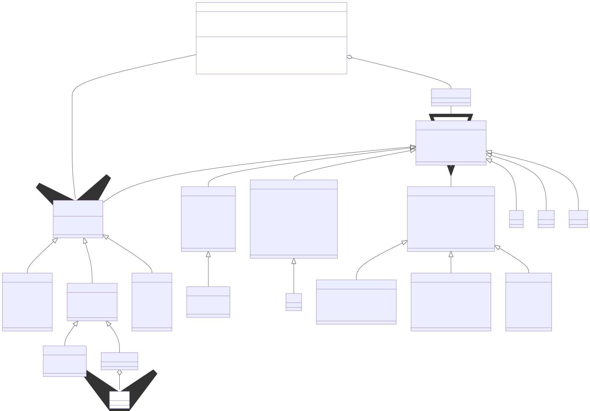

# Kurs in Computer-Simulation

Dieses Repository enthält Beispiele zum Thema Computer-Simulation.

* Modelle
* Vorlagen
* Dokumente

## 1. Modelle

In diesem Kurs betrachten wir zwei Arten von Modellen, die sich in der Modellierung der Zeit unterscheiden:

* Zeitkontinuierliche Modelle
* Zeitdiskrete Modelle

### 1.1. Zeitkontinuierliche Modelle

Bei den zeitkontinuierlichen Modellen betrachten wir zwei Beispiele, die sich in ihrer Komplexität leicht unterscheiden und für welche die analytischen Lösungen bereits bekannt sind:

* Ballwurf
* Federpendel

#### 1.1.1. [Ballwurf](./Quellen/SchieferWurf/)

Dieses Beispiel zeigt die **numerische Integration zeitkontinuierlicher Modelle** mit dem expliziten und dem impliziten Euler-Verfahren sowie den Vergleich der numerischen Lösungen mit der analytischen Lösung, welche für dieses einfache Integral noch berechnet werden kann.

#### 1.1.2. [Federpendel](./Quellen/Federpendel/)

*Kommt demnächst.*

### 1.2. Zeitdiskrete Modelle

Bei den zeitdiskreten Modellen können wieder zwei Arten unterschieden werden, die diskreten Zeitschritte durchzuführen:

* Fester Zeitschritt
* Variabler Zeitschritt

#### 1.2.1. Fester Zeitschritt

*Kommt demnächst.*

#### 1.2.2. Variabler Zeitschritt

*Kommt demnächst.*

## 2. Vorlagen

Das Repository enthält auch ein paar Vorlagen, welche du für die Entwicklung deiner eigenen Simulationsprogramme verwenden und auf deine Bedürfnisse anpassen kannst:

* 2D-Visualisierung mit WPF und ScottPlot
* 3D-Visualisierung mit WPF und SharpGL

### 2.1. [2D-Visualisierung mit **WPF und ScottPlot**](./Quellen/VorlageVisualisierung2D/)

Dieses Beispiel zeigt dir, wie du einfache 2D-Diagramme in deinen Simulationsprogrammen erstellen und anzeigen kannst.
Das Beispiel nutzt dafür das Microsoft WPF Framework für allgemeine grafische Benutzeroberflächen sowie ScottPlot für Diagrammvisualisierungen.

### 2.2. [3D-Visualisierung mit **WPF und SharpGL**](./Quellen/VorlageVisualisierung3D/)

Manchmal kann es auch hilfreich sein, 3D-Visualisierungen (z.B. des Systemzustands) in deine Simulationsprogramme zu integrieren.
Dieses Beispiel zeigt dir, wie du solche Visualisierungen mit SharpGL in deine WPF-Anwendungen einfach integrieren kannst.

Bei SharpGL kannst du die 3D-Visualisierungen in Form eines Szenengraphen einfach definieren.
Ein Szenengraph beschreibt den Inhalt einer 3D-Visualisierung in Form von Objekten und deren Zusammenhängen.
Die folgende Grafik zeigt die Klassen, aus welchen sich ein Szenengraph bei SharpGL zusammensetzt, und deren Beziehungen.

## 3. Dokumente

Hier sind noch ein paar wichtige Dokumente für jeden, der die Beispiele aus diesem Repository gerne nutzen möchte:

* [Änderungen](./CHANGELOG.md)
* [Beitragen](./CONTRIBUTING.md)
* [Lizenz](./LICENSE.md)