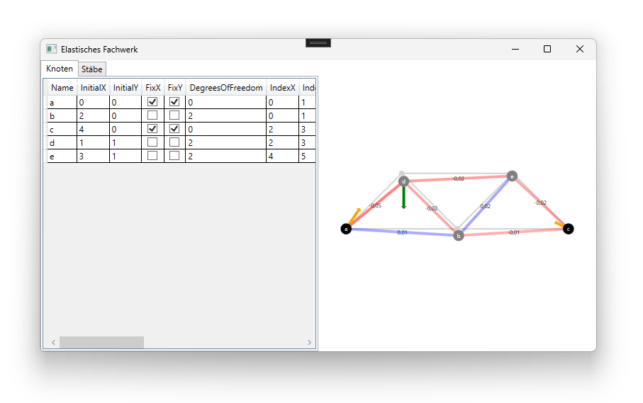
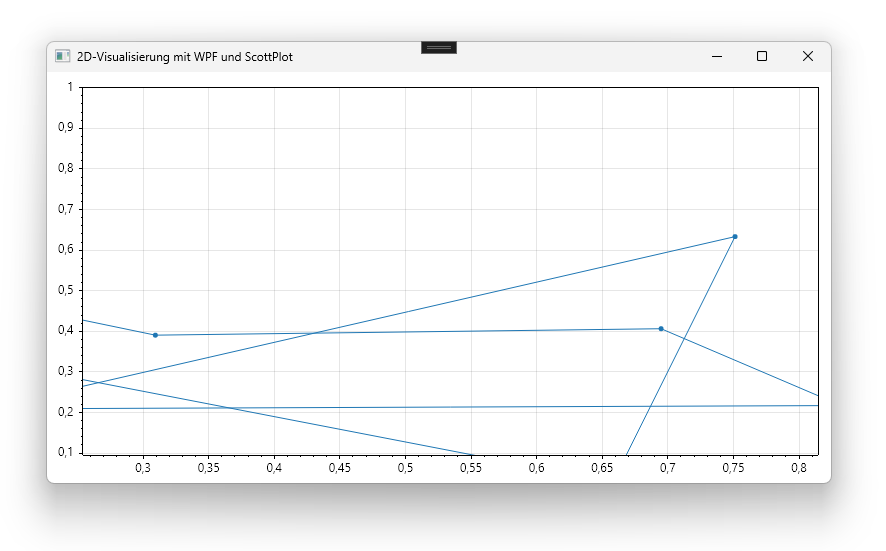

# Kurs in Computer-Simulation

Dieses Repository enthält Beispiele zum Thema Computer-Simulation, welche an der [Fakultät für Technik und angewandte Naturwissenschaften](https://fh-ooe.at/campus-wels) (engl. *School of Engineering*) der [Fachhochschule Oberösterreich](https://www.fh-ooe.at/) entwickelt wurden. Die Beispiele verwenden

* die Programmiersprache **C#** für die Umsetzung der Datenstrukturen und Algorithmen sowie
* das Framework **Windows Presentation Foundation (WPF)** für die Erstellung grafischer Benutzerschnittstellen.

Des Weiteren verwenden wir für die Umsetzung der Beispiele einige vorgefertigte Bibliotheken, welche grundlegende Funktionen für Berechnung und Visualisierung bereistellen. Die wichtigsten Bibliotheken sind

* **Math.NET Numerics** für die Lösung linearer Gleichungssysteme,
* **ScottPlott** für die Erstellung von Diagrammen, und
* **SharpGL** für die Erstellung von 3D-Visualisierungen.

Der folgende Inhalt ist in drei Abschnitte untergliedert:

1. **Modelle** (Übersicht die Simulationsmodelle und -programme)
1. **Vorlagen** (Übersicht der Vorlagen für 2D- und 3D-Visualisierung)
1. **Dokumente** (Übersicht der Dokumente rund um das Repository und den Quelltext)

## 1. Modelle

Grundsätzlich kann man zwischen statischen und dynamischen Modellen unterscheiden:

1. Statische Modelle (Betrachtung eines einzelnen stabilen Systemzustands)
1. Dynamische Modelle (Betrachtung der Änderung des Systemzustands über die Zeit)

### 1.1. Statische Modelle

Statische Modelle betrachten Systemzustände, bei denen es ohne externe Einwirkung zu keiner Zustandsänderung kommt.
Bei solchen Modellen sind typischerweise einige Zustandseigenschaften bekannt, andere jedoch nicht.
Das Systemmodell beschreibt dann den Zusammenhang zwischen den bekannten und den unbekannten Zustandseigenschaften.
Simulationsprogramme sind nun dafür verantwortlich, die *unbekannten* Zustandseigenschaften aus den bekannten zu berechnen.

Als Beispiel für statische Modelle betrachten wir im Folgenden das Konzept der **Fachwerke** aus der Bautechnik.
Ein Fachwerk ist ein System bestehend aus Knoten, die über Stäbe miteinander verbunden sind.
Des Weiteren sind einige der Knoten gelagert, d.h. deren Position im Raum ist fixiert.
Dabei können entweder alle Richtungungen oder nur eine Teilmenge der Richtungen fixiert sein.
Schließlich wirken auf die Knoten noch externe Kräfte in eine oder mehrere Richtungen.

Im Folgenden betrachten wir zwei Arten, wie Fachwerke modelliert werden können:

1. Ideales Fachwerk (die Länge der Stäbe ändert sich *nicht* unter Druck/Zug)
1. Elastisches Fachwerk (die Länge der Stäbe ändert sich unter Druck/Zug)

#### [Ideales Fachwerk](./Quellen/FachwerkIdeal/)

Bei einem idealen Fachwerk ist die Annahme, dass es durch externe Kräfte zu *keiner* Verformung des Fachwerks kommt.
Das heißt anders ausgedrückt, dass die Positionen der Knoten und die Längen der Stäbe unveränderlich sind.
Die unbekannten Zustandseigenschaften sind somit die Stab- und Lagerkräfte, welche auf Stäbe und gelagerte Knoten wirken.
Der Zusammenhang zwischen Stab- bzw. Lagerkräften und externen Kräften kann als lineares Gleichungssystem ausgedrückt werden.
Das lineare Gleichungssystem kann mit Hilfe der Matrixinversion gelöst werden, welche z.B. die Bibliothek [Math.NET Numerics](https://numerics.mathdotnet.com/) implementiert.

Die folgende Grafik zeigt das Datenmodell des Programms für die Berechnung der Lager- und Stabkräfte eines einfachen zweidimensionalen Fachwerks.
Über die Klasse ``Truss`` können Fachwerke inklusive der darin enthaltenen Knoten, Stäbe, Lager, und externen Kräfte definiert werden.
Des Weiteren bietet die Klasse ``Truss`` die Methode ``Solve``, welche mittels der Matrixinversion die Stab- und Lagerkräfte berechnet.
Die Visualisierung erfolgt schließlich mit einem ``DataGrid`` sowie einem ``Canvas``, welche die Windows Presentation Foundation (WPF) bereitstellt.

#### [Elastisches Fachwerk](./Quellen/FachwerkElastisch/)

Bei einem elastischen Fachwerk kann sich die Länge der Stäbe durch die Einwirkung einer externen Kraft verändern. Das Modell muss dafür um die Elastizität sowie die Querschnittfläche der Stäbe erweitert werden. Die unbekannten Zustandseigenschaften sind in diesem Fall die Verschiebungen der ungelagerten Knoten sowie die Lagerkräfte, welche an den gelagerten Knoten wirken. Der Zusammenhang zwischen Verschiebungen bzw. Lagerkräften und externen Kräften kann wieder vereinfacht als lineares Gleichungssystem ausgedrückt werden. Die Lösung erfolgt auch wieder mittels Matrixinversion.

Die folgende Grafik zeigt das Datenmodell des Simulationsprogramms. Die Klasse `Truss` kann verwendet werden, um Fachwerke zu definieren. Mit der Methode `AddNode(...)` können dem Fachwerk neue Knoten hinzugefügt werden. Dabei müssen die initiale Knotenposition sowie die Lagerung und externe Kräfte angegeben werden. Mit der Methode `AddRod(...)` können dem Fachwerk hingegen neue Stäbe hinzugefügt werden. Dabei müssen die beiden verbundenen Knoten sowie die Elastizität und die Querschnittsfläche angegeben werden. Die Methode `Solve()` berechnet schließlich die Lagerkräfte und Knotenverschiebungen.

### 1.2. Dynamische Modelle

Dynamische Modelle betrachten *nicht* einen einzelen stabilen Systemzustand, sondern die Änderung des Systemzustands über die Zeit.
Dafür muss in der Regel ein Startzustand sowie eine Zustandsübergangsfunktion gegeben sein.
Die Simulation rechnet dann den Zustand des Systems gemäß der Zustandsübergangsfunktion weiter.
Man kann grundsätzlich zwischen zwei Arten von Modellen unterschieden werden:

1. Zeitkontinuierliche Modelle (Modell beschreibt Zustand zu jedem Zeitpunkt)
1. Zeitdiskrete Modelle (Modell beschreibt Zustands nur zu ausgewählten Zeitpunkten)

#### 1.2.1. Zeitkontinuierliche Modelle

Bei den zeitkontinuierlichen Modellen betrachten wir zwei Beispiele, die sich in ihrer Komplexität leicht unterscheiden und für welche die analytischen Lösungen bereits bekannt sind:

1. Ballwurf
1. Federpendel

##### [Ballwurf](./Quellen/Ballwurf/)

Dieses Beispiel zeigt die **numerische Integration zeitkontinuierlicher Modelle** mit dem expliziten und dem impliziten Euler-Verfahren sowie den Vergleich der numerischen Lösungen mit der analytischen Lösung, welche für dieses einfache Integral noch berechnet werden kann.

##### [Federpendel](./Quellen/Federpendel/)

*Kommt demnächst.*

#### 1.2.2. Zeitdiskrete Modelle

Bei den zeitdiskreten Modellen können wieder zwei Arten unterschieden werden, die diskreten Zeitschritte durchzuführen:

1. Fester Zeitschritt
1. Variabler Zeitschritt

##### 1.2.2.1. Fester Zeitschritt

*Kommt demnächst.*

##### 1.2.2.2. Variabler Zeitschritt

*Kommt demnächst.*

## 2. Vorlagen

Das Repository enthält auch ein paar Vorlagen, welche du für die Entwicklung deiner eigenen Simulationsprogramme verwenden und auf deine Bedürfnisse anpassen kannst:

* 2D-Visualisierung mit WPF und ScottPlot
* 3D-Visualisierung mit WPF und SharpGL

### 2.1. [2D-Visualisierung mit **WPF und ScottPlot**](./Quellen/VorlageVisualisierung2D/)

Dieses Beispiel zeigt dir, wie du einfache 2D-Diagramme in deinen Simulationsprogrammen erstellen und anzeigen kannst.
Das Beispiel nutzt dafür das Microsoft WPF Framework für allgemeine grafische Benutzeroberflächen sowie ScottPlot für Diagrammvisualisierungen.

### 2.2. [3D-Visualisierung mit **WPF und SharpGL**](./Quellen/VorlageVisualisierung3D/)

Manchmal kann es auch hilfreich sein, 3D-Visualisierungen (z.B. des Systemzustands) in deine Simulationsprogramme zu integrieren.
Dieses Beispiel zeigt dir, wie du solche Visualisierungen mit SharpGL in deine WPF-Anwendungen einfach integrieren kannst.

Bei SharpGL kannst du die 3D-Visualisierungen in Form eines Szenengraphen einfach definieren.
Ein Szenengraph beschreibt den Inhalt einer 3D-Visualisierung in Form von Objekten und deren Zusammenhängen.
Die folgende Grafik zeigt die Klassen, aus welchen sich ein Szenengraph bei SharpGL zusammensetzt, und deren Beziehungen.

## 3. Dokumente

Hier sind noch ein paar wichtige Dokumente für jeden, der die Beispiele aus diesem Repository gerne nutzen möchte:

* [Änderungen](./CHANGELOG.md)
* [Beitragen](./CONTRIBUTING.md)
* [Lizenz](./LICENSE.md)